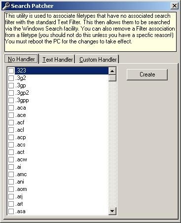



## SearchPatcher

### Description

(Uploaded fixed zip)

For adding filetypes to the Windows XP Search Tools Text Search.

On Windows XP the facility to look for text within a file only works against filetypes that have a filter defined. This means that .BAS, .CLS, .CTL, .FRM, .VBP (etc.) files are NOT scanned. This utility allows filetypes that have no associated search filter to be searched with the standard Text Filter.

I have knocked this up very quickly as one of my colleagues just asked me why he couldn't find a subroutine in our libraries on his new (Windows XP) machine when it was found on his old (Windows 98) machine! I hope it may be useful for someone else.

NOTE: You can also remove a Filter association from a filetype but you should not do this unless you have a specfic reason! You must reboot the PC for the changes to take effect.
 
### More Info
 

             |
---                |---
**Submitted On**   |2005-01-06 17:13:18
**By**             |[Richard Mewett](https://github.com/Planet-Source-Code/PSCIndex/blob/master/ByAuthor/richard-mewett.md)
**Level**          |Beginner
**User Rating**    |5.0 (15 globes from 3 users)
**Compatibility**  |VB 5\.0, VB 6\.0
**Category**       |[Complete Applications](https://github.com/Planet-Source-Code/PSCIndex/blob/master/ByCategory/complete-applications__1-27.md)
**World**          |[Visual Basic](https://github.com/Planet-Source-Code/PSCIndex/blob/master/ByWorld/visual-basic.md)
**Archive File**   |[SearchPatc183741172005\.zip](https://github.com/Planet-Source-Code/richard-mewett-searchpatcher__1-58132/archive/master.zip)

